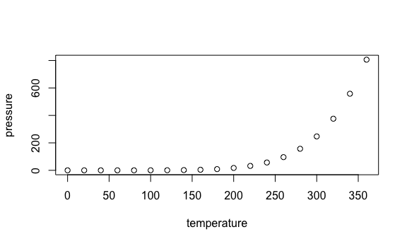

p8105_hw5_am5088
================
Anika Mitchell am5088

load my necessary libraries

## Problem 1

I’ve gone ahead and loaded my necessary libraries and set up plotting
for this problem (tidyverse), and will now start to develop a function
to address the following question:

Suppose you put 𝑛people in a room, and want to know the probability that
at least two people share a birthday. For simplicity, we’ll assume there
are no leap years (i.e. there are only 365 days) and that birthdays are
uniformly distributed over the year (which is actually not the case).

**Write a function that, for a fixed group size, randomly draws
“birthdays” for each person; checks whether there are duplicate
birthdays in the group; and returns TRUE or FALSE based on the result.**

``` r
summary(cars)
```

    ##      speed           dist       
    ##  Min.   : 4.0   Min.   :  2.00  
    ##  1st Qu.:12.0   1st Qu.: 26.00  
    ##  Median :15.0   Median : 36.00  
    ##  Mean   :15.4   Mean   : 42.98  
    ##  3rd Qu.:19.0   3rd Qu.: 56.00  
    ##  Max.   :25.0   Max.   :120.00

## Problem 1 Plots

You can also embed plots, for example:



Note that the `echo = FALSE` parameter was added to the code chunk to
prevent printing of the R code that generated the plot.
